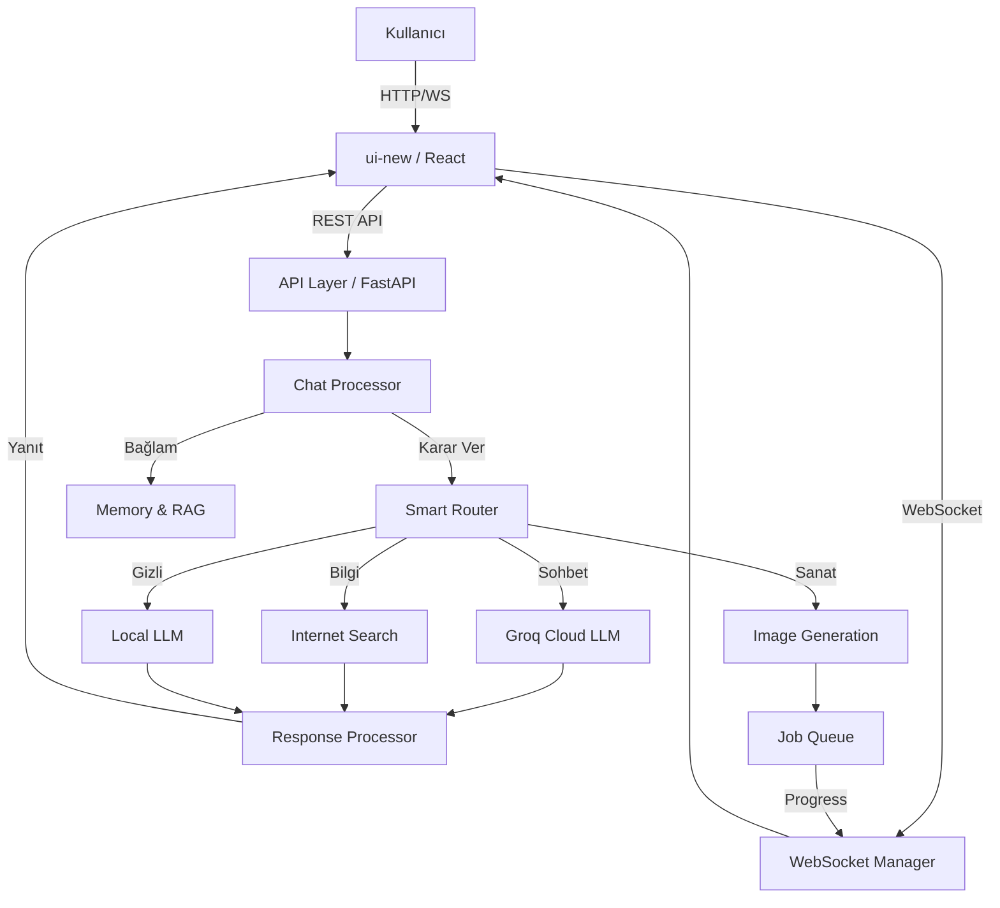

# Mami AI - Mimari Dokümantasyonu

Bu doküman, Mami AI projesinin güncel yapısını ve modüllerini açıklar.
Proje, **FastAPI (Backend)** ve **React/Vite (Frontend)** mimarisi üzerine kuruludur.

---

## 📁 Proje Yapısı

```
mami_ai_v4/
├── app/                      # 🐍 Backend (FastAPI)
│   ├── main.py               # Uygulama giriş noktası
│   ├── config.py             # Yapılandırma
│   │
│   ├── api/                  # HTTP Endpoints
│   │   └── routes/           # user_routes.py (chat, memory), system_routes.py...
│   │
│   ├── core/                 # Temel altyapı
│   │   ├── database.py       # SQLite & ChromaDB
│   │   ├── models.py         # SQLModel veritabanı şemaları
│   │   ├── logger.py         # Loglama sistemi
│   │   └── feature_flags.py  # Özellik yönetimi
│   │
│   ├── auth/                 # Kimlik doğrulama (JWT)
│   │   ├── dependencies.py   # Auth guardları
│   │   └── user_manager.py   # Kullanıcı işlemleri
│   │
│   ├── chat/                 # Sohbet Mantığı
│   │   ├── processor.py      # ⭐ Ana mesaj işlemcisi
│   │   ├── decider.py        # Model/Tool yönlendirme (Router)
│   │   └── answerer.py       # Yanıt üretim (LLM)
│   │
│   ├── image/                # 🎨 Görsel Üretim Sistemi
│   │   ├── manager.py        # İstek yönetimi
│   │   ├── job_queue.py      # Async iş kuyruğu
│   │   ├── flux_stub.py      # Forge API istemcisi
│   │   └── safe_callback.py  # Hata toleranslı callback
│   │
│   ├── memory/               # 🧠 Hafıza Sistemleri
│   │   ├── store.py          # Uzun vadeli semantik hafıza (ChromaDB)
│   │   ├── conversation.py   # Kısa vadeli sohbet geçmişi (SQLite)
│   │   ├── rag.py            # RAG (Doküman) sistemi
│   │   └── rag_v2.py         # Gelişmiş RAG (Sayfa bazlı)
│   │
│   └── services/             # Yardımcı servisler
│       └── formatting/       # Markdown/Code block işleme
│
├── ui-new/                   # ⚛️ Frontend (React + Vite)
│   ├── src/
│   │   ├── components/       # React bileşenleri (Chat, Settings, vb.)
│   │   ├── stores/           # Zustand state management
│   │   ├── hooks/            # Custom hooks (useWebSocket, etc.)
│   │   └── api/              # Backend istemcisi
│   └── index.html            # SPA giriş
│
├── alembic/                  # Veritabanı migrasyonları
├── data/                     # Runtime verileri (DB, Uploads)
├── docs/                     # Proje dokümantasyonları
├── scripts/                  # Yardımcı araçlar
└── tests/                    # Pytest testleri
```

---

## 🔄 Veri Akışı



---

## 🗃️ Veritabanı Şeması

### SQLite (App Data)
- **Users:** Kullanıcı hesapları ve yetkiler.
- **Conversations:** Sohbet başlıkları ve ayarları.
- **Messages:** Sohbet içeriği, rolü ve metadata (job_id vb.).
- **UserPreferences:** Kullanıcı tercihleri (sistem, format).

### ChromaDB (Vectors)
- **Memories:** Kullanıcı hakkında öğrenilen bilgiler (Semantik arama).
- **Rag_Docs:** Yüklenen PDF/TXT dokümanları (RAG).

---

## 🚀 Çalıştırma

### Backend
```bash
# Sanal ortam aktifken
uvicorn main:app --reload --host 0.0.0.0 --port 8000
```

### Frontend
```bash
cd ui-new
npm run dev
# http://localhost:5173
```

---

## 🔑 Önemli Servisler

1. **Chat Processor (`app/chat/processor.py`)**: Tüm sistemin beyni. Mesajı alır, hafızayı hazırlar, modele gönderir ve yanıtı işler.
2. **Memory Service (`app/services/memory_service.py`)**: ChromaDB ile konuşarak semantik hafıza araması ve "Duplicate Detection" yapar.
3. **Image Queue (`app/image/job_queue.py`)**: Görsel üretim isteklerini sıraya alır ve worker thread ile tek tek işler (GPU kilitlenmesini önler).

---
*Son Güncelleme: 19 Aralık 2025*
