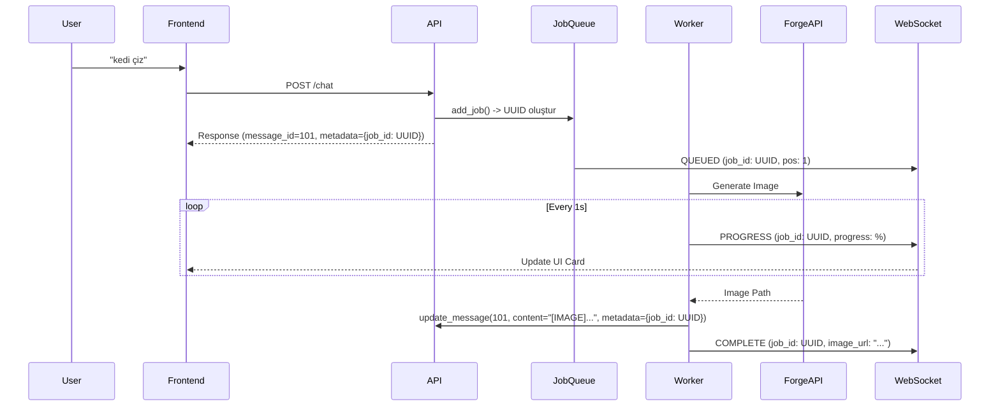

# Image Queue System - Proje Durumu ve Analiz

> **Son Güncelleme:** 19 Aralık 2025

---

## 1. MEVCUT SİSTEM

### 1.1 Temel Yapı
Mami AI, görsel üretim isteklerini asenkron bir kuyruk yapısı üzerinden yönetir. Bu yapı, uzun süren GPU işlemlerinin (Flux/Forge) ana uygulama thread'ini kilitlememesini sağlar.

- **Frontend:** Kullanıcı isteği gönderir, WebSocket üzerinden ilerleme durumunu dinler.
- **Backend:** `ImageJobQueue` isteği alır, worker thread'de işler.
- **Veritabanı:** Mesajlar `messages` tablosunda (Integer ID) saklanır, ancak `job_id` (UUID) metadata olarak tutulur.

### 1.2 ID Yönetimi (Önemli)
- **Message ID:** Database'de `Integer` (PK). Frontend'de mesajları sıralamak için kullanılır.
- **Job ID:** `UUID` string. Kuyruk takibi, WebSocket eventleri ve İptal işlemleri için kullanılır.
- **Eşleşme:** Mesajın `extra_metadata` alanında `{"job_id": "uuid..."}` saklanır.

---

## 2. AKIŞ DİYAGRAMI

---

## 3. DURUM ANALİZİ

### ✅ Çözülen Sorunlar
1.  **Callback Hata Yönetimi (`Hata #8`):**
    - `app/image/safe_callback.py` uygulandı. Callback sırasında oluşan hatalar artık worker'ı çökertmiyor.
    - Hata durumunda WebSocket üzerinden "ERROR" statüsü gönderiliyor.

2.  **Streaming & Race Condition (`Hata #5`):**
    - Streaming yanıtlar artık stream tamamlandıktan sonra veritabanına kaydediliyor.
    - Bu sayede aynı mesajın mükerrer kaydedilme riski azaltıldı.

### ⚠️ Devam Eden / Bilinmesi Gereken Durumlar
1.  **ID Eşleşmesi (Int vs UUID):**
    - Frontend'in WebSocket mesajlarını doğru karta eşleştirmesi için `job_id`'yi kullanması ŞARTTIR.
    - Eğer Frontend hala yerel/geçici ID kullanıyorsa progress bar güncellenmeyebilir.

2.  **Sayfa Yenileme:**
    - Sayfa yenilendiğinde aktif `job_id` bilgisi `/image/status` endpoint'inden çekilmelidir.
    - `get_job_status_endpoint` bu amaçla kullanılabilir.

---

## 4. BİLEŞENLER

### `app/image/job_queue.py`
- Ana kuyruk sınıfı. `asyncio.Queue` kullanır.
- Worker thread'ini başlatır ve yönetir.
- İptal (`cancel_job`) işlemlerini koordine eder.

### `app/image/manager.py`
- Chat işlemcisi ile Kuyruk arasındaki köprü.
- Mesaj oluşturma ve güncelleme işlerini yapar.

### `app/image/flux_stub.py`
- Stable Diffusion Forge API istemcisi.
- HTTP isteklerini yapar ve timeout/error handling sağlar.

### `app/image/safe_callback.py`
- Callback fonksiyonlarını `try/except` bloğuna alan decorator/wrapper.

---

## 5. İLERİYE DÖNÜK PLANLAR

- [ ] **Batch Generation:** Tek seferde 4 varyasyon üretme.
- [ ] **Image History:** Sadece görsellerden oluşan özel bir galeri görünümü (Frontend hazır, Backend API uyumu bekleniyor).
- [ ] **Upscaling:** Üretilen görselleri büyütme desteği.
